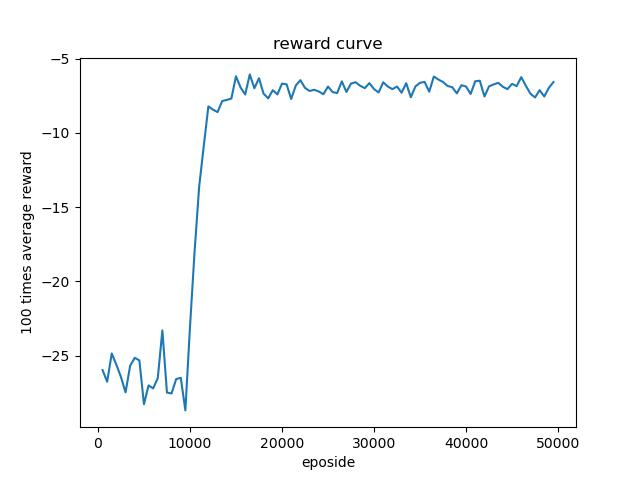
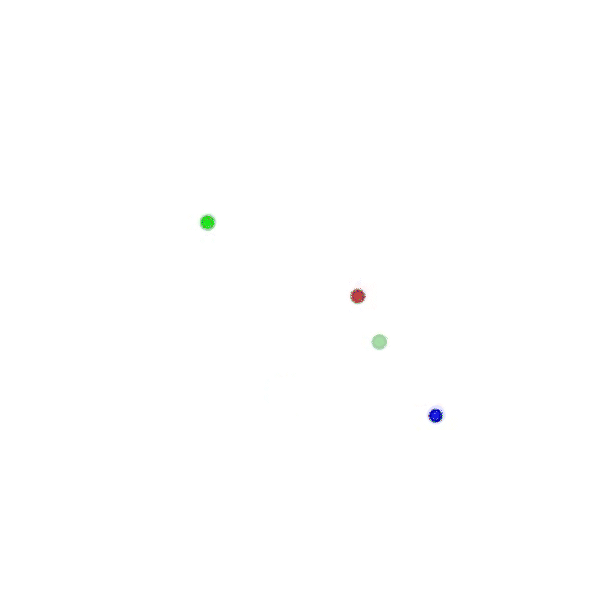

# MADDPG论文复现


本仓库尝试复现多智能体强化学习领域中很经典的算法[Multi-Agent Actor-Critic for Mixed Cooperative-Competitive Environments](https://paperswithcode.com/paper/multi-agent-actor-critic-for-mixed#code)(MADDPG)。具体的论文内容可以参考原文。这篇论文的基本思想是采用了集中式训练分布式执行的方式，每个agent都依靠自己和其他人的动作状态来进行学习。整体的算法思路并不是很难，但是想要完全实现并不是很简单。仓库中的代码基本上是在参考[philtabor的MADDPG实现](https://github.com/philtabor/Multi-Agent-Deep-Deterministic-Policy-Gradients)做出来的。因为phitabor的代码很老了，还是用的论文最原始的环境，所以在本仓库的实现中采用了pettingzoo的MPE环境。

官方的代码使用的是tensorflow。但是相比之下pytorch的文档更加友好，所有本仓库使用pytorch进行开发。但是**官方实现的代码多智能体之间能够学习到合作的策略**。比如在simple_adversary场景中，官方代码中的两个agent的可以一个去占领target landmark，另一个agent去占领其他的landmark来欺骗adversary。但是**本仓库的代码在实现后并不能学习到合作的策略，但是对于对抗策略学习还是比较理想的。受限于时间和能力的关系，实在是不知道问题出现在哪里，如果您能发现问题所在，欢迎您的指正**。

在测试方面，在simple_push环境下进行了训练测试。训练中的详细藏参数可以见main.py中的配置参数。simple_push取得运行效果虽然不错，但是有的时候依旧会出现不能收敛或者学习不到有效策略的情况。其他的一些环境比如simple_adversary或者simple_tag都进行了测试，但是并没有取得理想的结果，都是只有一个agent和一个adversary进行对抗。因为是初学者，所以暂时就只能做成这样了。没有更多的时间再研究了。

代码的运行很简单，首先要安装一些需要的包，但是注意如果想用GPU的话pytorch的版本一定要和cuda对应上。仓库里现有的模型是用CPU训练的，所以加载的时候只能用CPU加载，可以自己选择用GPU重新训练一个GPU版本的模型然后用GPU加载：

```
matplotlib==3.5.1  
numpy==1.23.2  
PettingZoo==1.19.0  # 安装的时候pip install pettingzoo[mpe]
torch==1.12.1  
tqdm==4.64.0
```

文件结构如下所示：

```
main.py  主运行文件
maddpg/
    看名字就可以 
outputs/
    models/
        模型文件夹
    results/
        训练过程平均奖励图
```

推荐还是使用ide进行运行测试，因为pettingzoo的并行执行环境创建我并没有找到通用方法，所以如果想要在不同的环境测试下测试的话，需要修改main.py文件中的三个地方：

1. from pettingzoo.mpe import (你想用的环境)

2. parser.add_argument('--env_name', default='（你想用的环境名称）', type=str, help="name of environment")

3. make_env中的env = (环境包).parallel_env(continuous_actions=continuous_actions, max_cycles=max_cycles)

参数中的evaluate为False代表的是训练模式，为True的时候代表的是测试模式。其他的参数就是参数名称的含义。

在运行的时候，打开main文件，修改完想要的参数，先开启训练模式(evaluate = False)，根据控制台的输出情况，训练出一个比较理想的模型。因为有的时候一次训练难以成功，所以可能需要多次尝试。训练完成后，开启测试模式(evaluate = True)，就会有演示窗口。我挑选了一次训练(simple_push)的奖励变化如下所示：


测试效果如下所示:



最后其实这个代码很多地方设计的都是不太合理的，还有一些需要注意的问题：

1. 最明显的就是经验池的设计，这个一开始没设计好，现在再改也太麻烦了。仓库中的经验池是采用先初始化空间大小，然后按照索引存数据，这样就会导致经验池容量特别大的时候初始化非常慢。所以以后设计经验池的时候一定要采用增量式存储。
2. 其次是actor网络最后一层的输出到底是采用tanh还是softmax这个最终也没得到一个合理的结论。
3. 在稀疏奖励的环境下，采用有效的探索-利用是十分有必要的。
4. 平均奖励的记录方式也很重要，这涉及到我们在训练过程中把握训练情况，绝对不能草率了事。
5. 注意每个函数的输入输出是否正确，尤其要注意状态变量的更新。在复现的时候这一点上吃了大亏。